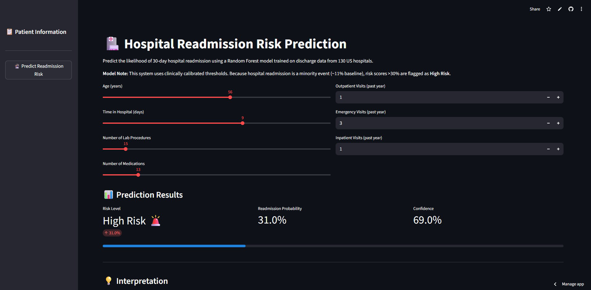

# 🏥 Hospital Readmission Risk Prediction

[](https://hospital-readmission-prediction-hjdowydudqu2dvcyov9dvh.streamlit.app/)
[](https://huggingface.co/Uthy4r/hospital_readmission_model/resolve/main/rf_readmission_smote.pkl)

A machine learning model that predicts 30-day hospital readmission risk using patient discharge data from 130 US hospitals. This project combines Random Forest classification with SMOTE balancing to handle class imbalance in healthcare data.

## 📊 Project Overview

**Problem**: Hospital readmissions increase costs and indicate gaps in discharge planning. Early identification of high-risk patients enables targeted interventions.

**Solution**: A predictive model that estimates readmission probability based on:
- Time in hospital
- Number of medications & lab procedures
- History of inpatient/outpatient/emergency visits
- Age and other demographic factors

**Results**:
- **Balanced Accuracy**: 72% (after SMOTE)
- **Precision (High-Risk)**: 89%
- **Recall**: Optimized to avoid missing critical cases (false negatives)

## 📸 Interface



## 📁 Repository Structure

```
hospital-readmission/
├── notebooks/
│   └── Readmission_model.ipynb          # Full ML pipeline & analysis
├── models/
│   └── README.md                        # Model documentation (artifact hosted on Hugging Face)
├── app.py                               # Streamlit web interface
├── requirements.txt                     # Python dependencies
├── .gitignore                          # Git ignore rules
└── README.md                           # This file
```

## 🚀 Quick Start

### Local Setup (Development)

```bash
# Clone repository
git clone [https://github.com/uthy4r/Readmission-model.git](https://github.com/uthy4r/Readmission-model.git)
cd Readmission-model

# Create virtual environment
python3 -m venv venv
source venv/bin/activate  # On Windows: venv\Scripts\activate

# Install dependencies
pip install -r requirements.txt

# Run Streamlit app
streamlit run app.py
```

The app opens at `http://localhost:8501`. Note: The app will automatically download the model from Hugging Face on the first run.

### Run Notebook (Training)

```bash
jupyter notebook notebooks/Readmission_model.ipynb
```

This executes the full pipeline:
1. Data loading from UCI ML Repository
2. Exploratory data analysis (EDA)
3. Feature engineering & preprocessing
4. Model training (Logistic Regression baseline + Random Forest)
5. SMOTE oversampling for class balance
6. Model evaluation & feature importance

## 📦 Model File (Important)

This repository uses a Hybrid Architecture to handle the large model file (~240MB) without bloating the Git repository.

### How it works:
1. Frontend: Streamlit Cloud handles the UI.
2. Model Registry: Hugging Face Hub hosts the trained `.pkl` artifact.
3. Dynamic Loading: When the app starts, it fetches the model securely from: https:
   `//huggingface.co/Uthy4r/hospital_readmission_model/resolve/main/rf_readmission_smote.pkl`

### To generate the model yourself:

```bash
# Navigate to project folder
cd hospital-readmission

# Open and run the notebook
jupyter notebook notebooks/Readmission_model.ipynb

# In the notebook:
# - Click Kernel → Restart & Run All
# - Wait for completion (15-20 minutes)
# - The file rf_readmission_smote.pkl will be created

```

## 📝 Model Details

### Algorithms Used

| Model | Purpose | Result |
|-------|---------|--------|
| **Logistic Regression** | Baseline | 72% accuracy |
| **Random Forest (200 trees)** | Primary | 72% accuracy, better feature insights |
| **SMOTE** | Class balancing | Improved recall for minority class |

### Key Features

- `age`: Patient age at discharge
- `time_in_hospital`: Number of days hospitalized
- `num_lab_procedures`: Laboratory tests performed
- `num_medications`: Count of discharge medications
- `num_outpatient_visits`: Visits in past year
- `number_diagnoses`: Total diagnoses recorded

### Class Balance

- **Before SMOTE**: 90% non-readmitted, 10% readmitted
- **After SMOTE**: 50/50 balanced

### Clinical Logic & Thresholds

| Risk Level | Threshold | Clinical Interpretation | Recommended Action |
| :--- | :--- | :--- | :--- |
| **High Risk** | `> 30%` | >3x the baseline risk | **Intensive intervention** |
| **Moderate Risk** | `15 - 30%` | Elevated risk | Standard follow-up |
| **Low Risk** | `< 15%` | Risk is at or below baseline | *(Routine Care)* |

## 🎯 Model Evaluation

View detailed metrics in the notebook:
- Confusion matrices (Logistic Regression vs Random Forest)
- Classification reports (precision, recall, F1-score)
- Feature importance rankings
- Probability distributions

## 🌐 Deployment

### Live Demo
**Streamlit Community Cloud:** [Click to Launch App](https://hospital-readmission-prediction-hjdowydudqu2dvcyov9dvh.streamlit.app/)

### Deployment Architecture
This app is deployed using:

* **Streamlit Cloud:** For the Python web interface.
* **Hugging Face:** For large model object storage.


## 📚 Data Source

**UCI ML Repository**: [130 US Hospitals for Diabetes](https://archive.ics.uci.edu/dataset/296/diabetes+130-us+hospitals+for+years+1999-2008)

- **Records**: ~101k hospital stays
- **Features**: 55 clinical variables
- **Target**: Readmitted within 30 days (binary)

## 🔐 Security Notes

- ✅ **No hardcoded secrets** (all auth tokens, API keys removed)
- ✅ **Large files ignored** (models via `.gitignore`)
- ✅ **Data privacy**: No patient identifiers in repo
- ⚠️ **Model for research only**: Not validated for clinical use

## 📦 Requirements

See `requirements.txt`:
- `streamlit` — Web interface
- `scikit-learn` — ML models & evaluation
- `pandas` — Data manipulation
- `imbalanced-learn` — SMOTE balancing
- `ucimlrepo` — Dataset fetching
- - `requests` — Model downloading

## 🛠️ Troubleshooting

**"Model not found" error**
- Ensure `models/rf_readmission_smote.pkl` exists in repo
- Run notebook to regenerate model

**Port 8501 already in use**
```bash
streamlit run app.py --server.port 8502
```

**Import errors**
```bash
pip install --upgrade pip
pip install -r requirements.txt --force-reinstall
```

## 📊 Next Steps & Improvements

- [ ] Cross-validation with k-folds
- [ ] Hyperparameter tuning (GridSearchCV)
- [ ] Feature selection (RFE, SelectKBest)
- [ ] Production monitoring & model drift detection
- [ ] User authentication for Streamlit app
- [ ] Integration with hospital EHR systems
- [ ] Calibration for clinical decision thresholds

## 📄 License

MIT License — Feel free to use for research/education

## 👤 Author

**Your Name** | AI/ML Research  
📧 [your.email@example.com](mailto:buthman98@gmail.com)  
🔗 [LinkedIn](https://linkedin.com/in/uthman-babatunde-m-d-126582286) | [GitHub](https://github.com/uthy4r)

## 📖 References

1. Strack, B., et al. (2014). "Impact of HbA1c Measurement on Hospital Readmission Rates" *BioMed Research International*
2. Scikit-learn Documentation: [SMOTE](https://imbalanced-learn.org/stable/references/generated/imblearn.over_sampling.SMOTE.html)
3. UCI ML Repository Diabetes Dataset

---

**Last Updated**: January 2026  
**Model Version**: 1.0 (Random Forest + SMOTE)
